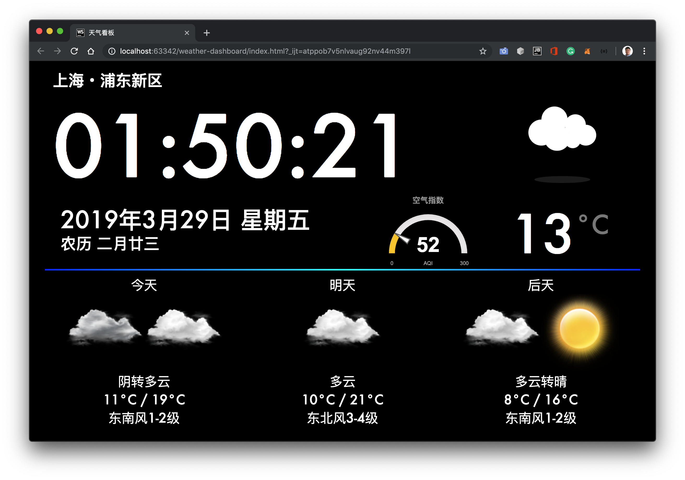

# Weather Dashboard
A simple HTML & CSS based weather dashboard used to be loaded on the raspberry pi in my university dormitory.



# Installation
```
git clone https://github.com/realJustinLee/weather-dashboard.git
cd weather-dashboard
python3 -m http.server
chromium-browser --kiosk "0.0.0.0:8000"
```

# Notice
This branch is deprecated and discontinued