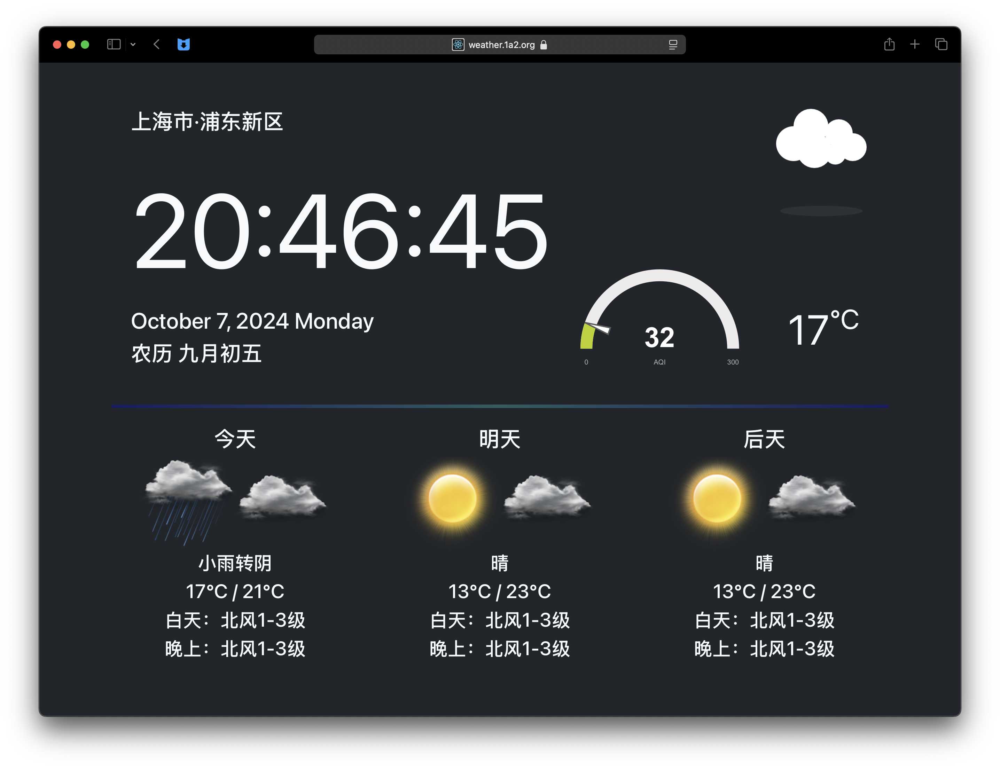

# weather-dashboard

The weather dashboard meant to run on RSBP

## Main Requirements

> - node.js `v19.0.0`
> - react.js `18.2.0`

## Version

- `0.1.0`

## Platform Compatibility

- [x] macOS
- [x] Linux
- [x] Windows 11

## Installation Guide

Run the following code in the terminal to install and run the project.

```
git clone https://github.com/realJustinLee/weather-dashboard.git
cd weather-dashboard
npm run reinstall
npm start
```

## Screen Shots

The Dashboard


## TODO

- [ ] Release this project to a desktop app with electron.

# Made with ❤ by [Justin Lee](https://github.com/realJustinLee)!

™ and © 1997-2022 Justin Lee. All Rights Reserved. [License Agreement](./LICENSE)
